# 鼓楼破损检测项目

[](#项目简介)
[](#模型版本对比)
[](#数据集构建)

本项目面向鼓楼木构建筑表面破损区域检测，围绕增冲鼓楼、朝利鼓楼和从江鼓楼三组实例，完成视频抽帧、图像标注、数据集构建、单案例模型训练、三鼓楼融合模型训练和模型版本对比实验。项目主页参考 [SoTA-Point-Cloud](https://github.com/QingyongHu/SoTA-Point-Cloud) 的 GitHub README 展示方式，将数据、方法、结果和可视化材料集中整理。

<p align="center">
  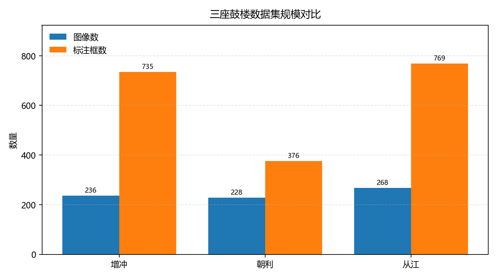
</p>

## 项目简介

项目以无人机采集的鼓楼图像和视频为原始数据来源，将建筑表面可见破损区域作为单类别目标 `damage` 进行检测。实验设计分为两条线：一是分别训练三座鼓楼的单案例模型，用于分析不同实例的局部检测效果；二是融合三座鼓楼数据训练通用模型，用于评估跨实例的整体适用性。

模型版本对比仅在三鼓楼通用数据集上进行。这样可以保证 YOLOv8n、YOLOv9t、YOLOv10n 和 YOLO11n 使用同一套训练与测试口径，避免单案例重复训练带来的结果分散。

## 研究流程图

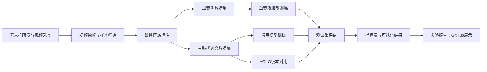

## 数据集构建

| 数据集 | 图像数 | 正样本 | 负样本 | 标注框 | 正样本比例 |
|---|---:|---:|---:|---:|---:|
| 增冲鼓楼 | 236 | 170 | 66 | 735 | 72.03% |
| 朝利鼓楼 | 228 | 164 | 64 | 376 | 71.93% |
| 从江鼓楼 | 268 | 193 | 75 | 769 | 72.01% |
| 三鼓楼通用数据集 | 732 | 527 | 205 | 1880 | 71.99% |

三组实例均保持接近的正负样本比例。朝利鼓楼的标注框总数较低，主要原因是单张正样本中可标注破损区域数量较少，不代表样本规模不足。

## 算法方法

### 视频抽帧

原始视频按固定时间间隔抽取样本帧，并结合人工筛选形成候选图像集合。抽帧样本用于标注、预检测检查和报告展示，正式评价以划分后的测试集指标为准。

### YOLOv8n检测模型

YOLOv8n 作为基础检测模型，采用单阶段目标检测流程：输入图像经主干网络提取多层特征，颈部结构进行多尺度融合，检测头输出破损区域的边界框、置信度和类别结果。由于本项目只检测一种破损类别，类别空间设置为 `damage`。

### 单案例模型

单案例模型分别使用增冲、朝利和从江鼓楼的独立数据集训练，用于分析每座鼓楼自身纹理、拍摄角度和破损形态对检测效果的影响。

### 三鼓楼通用模型

通用模型使用三座鼓楼融合数据集训练，目标是提高模型对不同鼓楼实例的适用性。该模型同时在合并测试集和三座鼓楼的分测试集上评估。

### YOLO版本对比

为比较不同 YOLO 版本在鼓楼破损检测任务中的表现，以三鼓楼融合数据集为统一训练基础，对 YOLOv8n、YOLOv9t、YOLOv10n 和 YOLO11n 进行横向对比。

## 实验结果

### 单案例模型指标

| 模型/测试集 | Precision | Recall | mAP50 | mAP50-95 |
|---|---:|---:|---:|---:|
| 增冲单案例模型 / 增冲测试集 | 0.867 | 0.873 | 0.890 | 0.394 |
| 朝利单案例模型 / 朝利测试集 | 0.750 | 0.468 | 0.545 | 0.261 |
| 从江单案例模型 / 从江测试集 | 0.719 | 0.595 | 0.612 | 0.186 |

### 通用模型指标

| 模型/测试集 | Precision | Recall | mAP50 | mAP50-95 |
|---|---:|---:|---:|---:|
| 三鼓楼通用模型 / 合并测试集 | 0.855 | 0.691 | 0.755 | 0.317 |
| 三鼓楼通用模型 / 增冲测试集 | 0.924 | 0.880 | 0.887 | 0.433 |
| 三鼓楼通用模型 / 朝利测试集 | 0.802 | 0.656 | 0.702 | 0.311 |
| 三鼓楼通用模型 / 从江测试集 | 0.815 | 0.527 | 0.618 | 0.213 |

### 模型版本对比

| 模型 | 测试集 | Precision | Recall | mAP50 | mAP50-95 | 推理耗时 ms/img |
|---|---|---:|---:|---:|---:|---:|
| YOLOv8n | 三鼓楼合并测试集 | 0.855 | 0.691 | 0.755 | 0.317 | 4.38 |
| YOLOv9t | 三鼓楼合并测试集 | 0.801 | 0.711 | 0.753 | 0.322 | 7.50 |
| YOLOv10n | 三鼓楼合并测试集 | 0.766 | 0.591 | 0.649 | 0.251 | 5.44 |
| YOLO11n | 三鼓楼合并测试集 | 0.871 | 0.608 | 0.725 | 0.304 | 5.85 |

YOLOv8n 在 mAP50 上略高，YOLOv9t 在 Recall 和 mAP50-95 上更优，YOLO11n 的 Precision 最高。综合精度和模型稳定性，YOLOv8n 和 YOLOv9t 是本任务中更值得保留的候选模型。

<p align="center">
  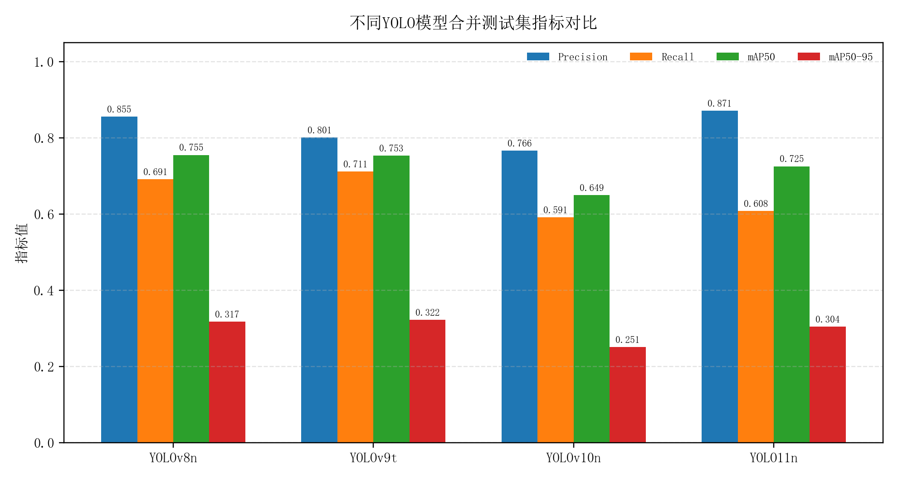
</p>

完整模型版本对比见 [results/model_compare_metrics.md](./results/model_compare_metrics.md) 和 [results/all_model_compare_metrics.json](./results/all_model_compare_metrics.json)。

## 可视化结果

### 指标对比

<p align="center">
  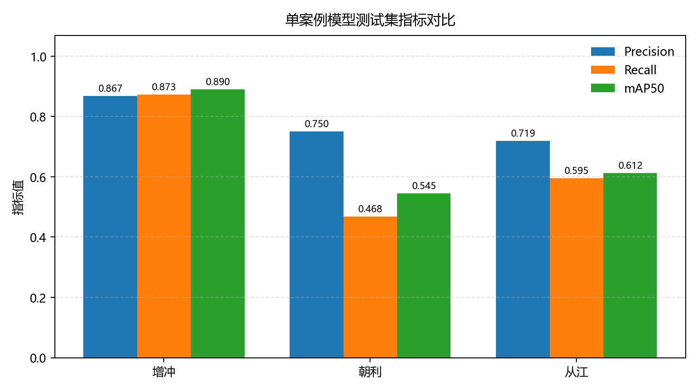
  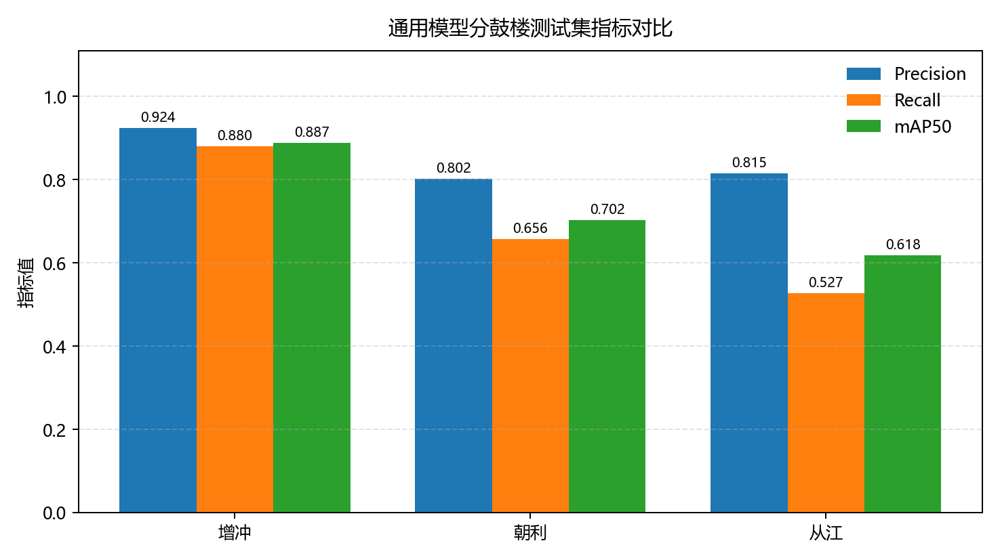
</p>

<p align="center">
  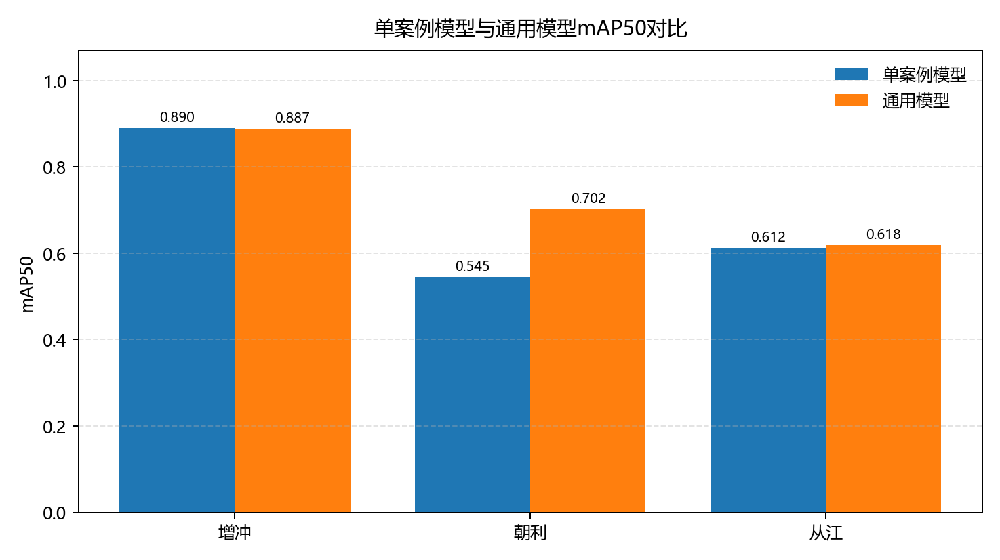
</p>

### 训练曲线与PR曲线

<p align="center">
  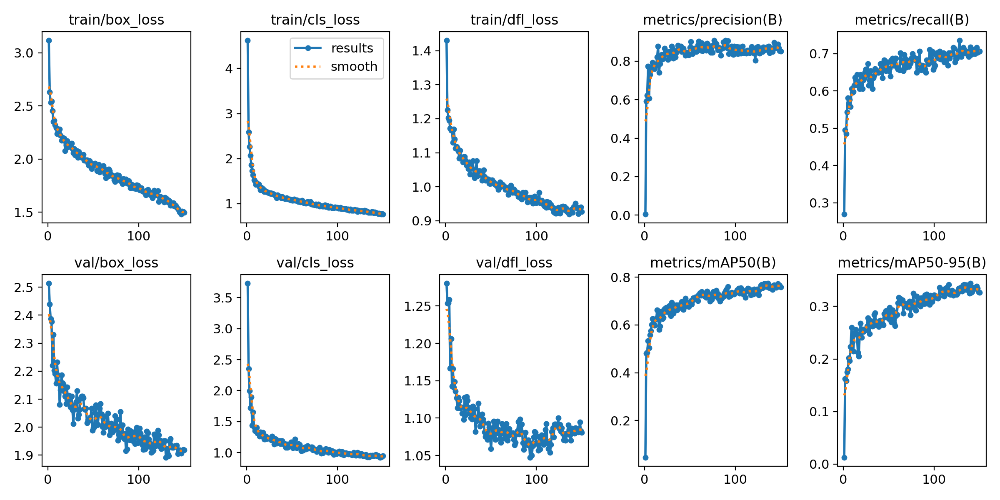
  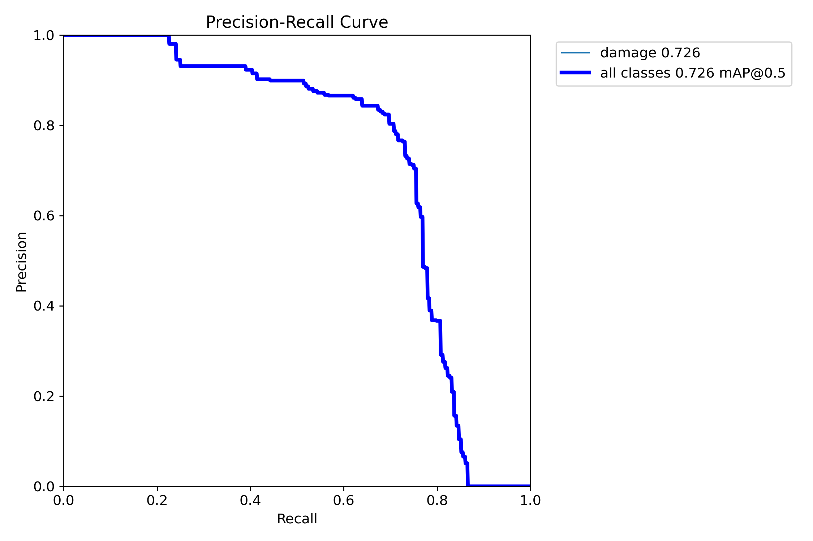
</p>

### 混淆矩阵

<p align="center">
  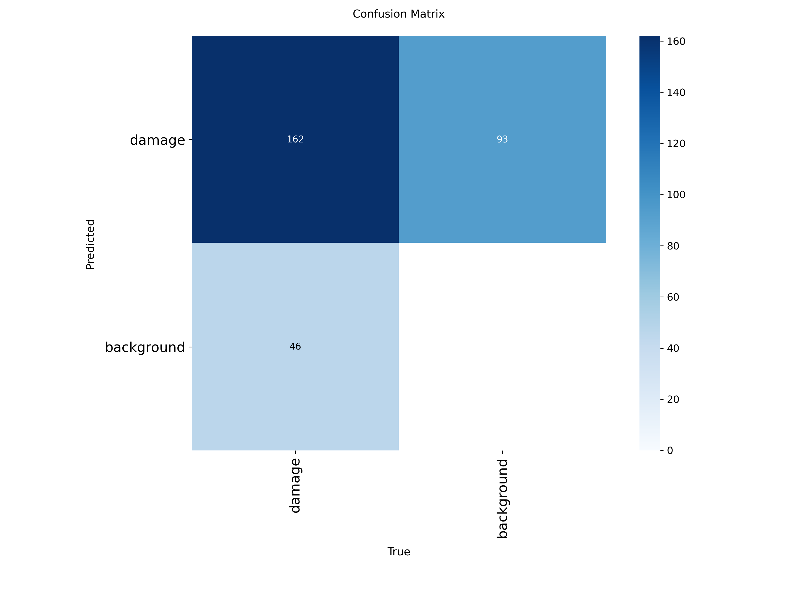
</p>

### 原图与检测结果对照

左侧为原始测试图像，右侧为同一图像叠加检测框后的结果。

<p align="center">
  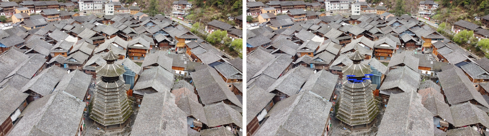
</p>
<p align="center">
  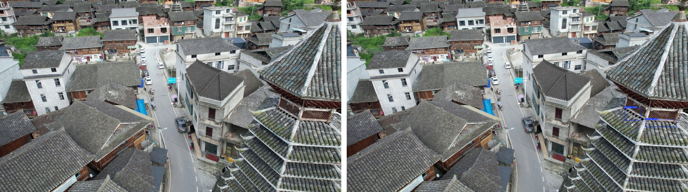
</p>
<p align="center">
  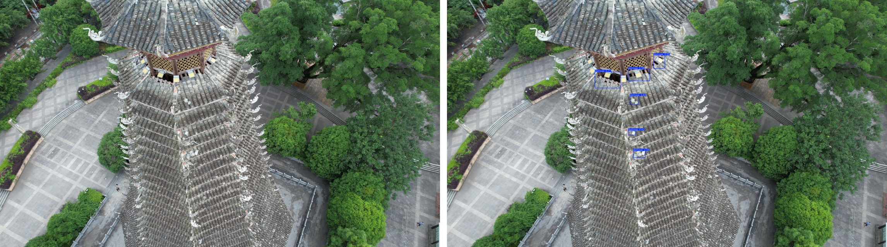
</p>

## 代码使用方法

关键脚本已整理到 [scripts](./scripts) 目录。原始视频、完整数据集和模型权重体积较大，未直接放入本展示包，正式复现实验时需按本地目录结构准备数据。

```bash
# 构建run9数据集
python scripts/prepare_run9_datasets.py

# 训练三鼓楼通用模型
python scripts/train_run9_model.py

# 训练通用数据集上的模型版本对比
python scripts/train_run9_model_compare.py --models yolov9t yolov10n yolo11n

# 评估单案例和通用模型
python scripts/evaluate_run9_models.py

# 评估模型版本对比
python scripts/evaluate_run9_model_compare.py
```

## 报告下载

- [增冲鼓楼破损检测单案例实验报告](./reports/增冲鼓楼破损检测单案例实验报告.docx)
- [朝利鼓楼破损检测单案例实验报告](./reports/朝利鼓楼破损检测单案例实验报告.docx)
- [从江鼓楼破损检测单案例实验报告](./reports/从江鼓楼破损检测单案例实验报告.docx)
- [三鼓楼实例融合实验报告](./reports/三鼓楼实例融合实验报告.docx)，其中包含融合数据集、通用模型训练、泛化评价和YOLO版本对比内容。

## Reference / Citation

本项目的 GitHub 展示结构参考 [Deep Learning for 3D Point Clouds: A Survey](https://github.com/QingyongHu/SoTA-Point-Cloud)。历史建筑破损检测的问题背景和实验组织方式参考：

```bibtex
@article{chen2025historicmasonry,
  title={Deep learning-driven pathology detection and analysis in historic masonry buildings of Suzhou},
  author={Chen, Xi and He, Jiabao and Wang, Shiruo},
  journal={npj Heritage Science},
  year={2025}
}
```

## Updates

- 2026-05-31: 整理 GitHub 展示页，加入三鼓楼数据集统计、单案例模型、通用模型和 YOLO 版本对比结果。
