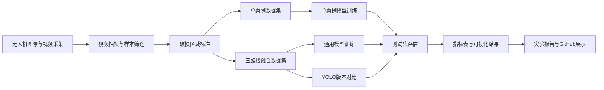

# 鼓楼破损检测项目

[](#项目简介)
[](#模型版本对比)
[](#数据集构建)

本项目面向鼓楼木构建筑表面破损区域检测，围绕增冲鼓楼、朝利鼓楼和从江鼓楼三组实例，完成视频抽帧、图像标注、数据集构建、单案例模型训练、三鼓楼融合模型训练和模型版本对比实验。项目主页参考 [SoTA-Point-Cloud](https://github.com/QingyongHu/SoTA-Point-Cloud) 的 GitHub README 展示方式，将数据、方法、结果和可视化材料集中整理。

<p align="center">
  
</p>

## 项目简介

项目以无人机采集的鼓楼图像和视频为原始数据来源，将建筑表面可见破损区域作为单类别目标 `damage` 进行检测。实验设计分为两条线：一是分别训练三座鼓楼的单案例模型，用于分析不同实例的局部检测效果；二是融合三座鼓楼数据训练通用模型，用于评估跨实例的整体适用性。

模型版本对比仅在三鼓楼通用数据集上进行。这样可以保证 YOLOv8n、YOLOv9t、YOLOv10n 和 YOLO11n 使用同一套训练与测试口径，避免单案例重复训练带来的结果分散。

## 研究流程图



## 数据集构建

| 数据集 | 图像数 | 正样本 | 负样本 | 标注框 | 正样本比例 |
|---|---:|---:|---:|---:|---:|
| 增冲鼓楼 | 236 | 170 | 66 | 735 | 72.03% |
| 朝利鼓楼 | 228 | 164 | 64 | 376 | 71.93% |
| 从江鼓楼 | 268 | 193 | 75 | 769 | 72.01% |
| 三鼓楼通用数据集 | 732 | 527 | 205 | 1880 | 71.99% |

三组实例均保持接近的正负样本比例。朝利鼓楼的标注框总数较低，主要原因是单张正样本中可标注破损区域数量较少，不代表样本规模不足。

## 算法方法

参考论文采用“无人机影像采集-病害标注-模型训练-立面检测-结果可视化”的研究框架。本项目沿用这一类历史建筑病害检测的技术路线，但根据现有标注形式选择目标检测任务：模型输出破损区域的矩形边界框、置信度和类别标签，而不是像素级掩码。整体方法由数据获取、样本标注、模型训练、测试集评价和可视化展示组成。

### 整体算法框架

输入图像首先被统一缩放到模型训练尺寸，并进行归一化和数据增强。随后，YOLO 系列模型通过主干网络提取纹理、边缘和局部结构特征；通过颈部网络融合不同尺度的特征图；最后由检测头预测破损区域位置、目标置信度和类别概率。对于鼓楼木构建筑而言，破损区域常呈现尺度小、形状不规则、背景纹理复杂等特点，因此多尺度特征融合和测试集泛化能力是本实验重点关注的部分。

### 视频抽帧与样本筛选

视频抽帧用于把连续无人机视频转换为可标注图像样本。可以把原始视频看作一组连续帧序列，例如 `f1, f2, ..., fn`；抽帧就是按照固定时间间隔从中选取代表帧，形成候选图像集合，例如 `i1, i2, ..., im`。这种处理可以降低连续视频中相邻帧的重复度，同时保留不同视角、距离和光照下的鼓楼表面信息。

抽帧后结合人工筛选和标注，保留包含清晰鼓楼立面、破损细节可见、画面模糊较少的样本。正式评价不直接使用视频检测统计，而是使用划分后的测试集指标，保证实验结果具有可复核性。

### 标注与数据集构建

本项目将所有可见破损区域统一定义为单类别 `damage`。标注采用 YOLO 边界框格式，每个目标由类别编号和归一化边界框表示：

```text
class_id x_center y_center width height
```

其中 `x_center` 和 `y_center` 表示边界框中心点坐标，`width` 和 `height` 表示边界框宽度与高度。四个数值都不是原始像素值，而是相对于图像宽高归一化后的比例值，取值范围为 0 到 1。例如，`x_center=0.50` 表示目标中心位于图像宽度方向的中间位置。这种格式适合轻量化目标检测模型训练，也便于在不同鼓楼实例之间合并数据集。

数据集构建分为两类：第一类是单案例数据集，分别对应增冲、朝利和从江鼓楼；第二类是三鼓楼融合数据集，将三组实例统一合并后训练通用模型。前者用于观察模型在单一建筑实例上的拟合效果，后者用于验证模型面对不同鼓楼纹理和拍摄条件时的泛化能力。

### YOLO目标检测原理

YOLO 的全称是 You Only Look Once，属于单阶段目标检测算法。它的核心思想是：模型只需要对输入图像进行一次前向计算，就同时完成“目标在哪里”和“目标是什么”的预测。相比先生成候选区域、再进行分类的两阶段检测方法，YOLO 直接在特征图上预测目标边界框和类别概率，因此速度更快，适合无人机图像和视频帧的批量检测。

在本项目中，YOLO 的检测过程可以理解为以下步骤：

1. 输入鼓楼图像后，模型先将图像缩放到统一尺寸，并把像素值转换为网络可以处理的张量。
2. Backbone 从图像中提取多层视觉特征，包括木材纹理、边缘变化、颜色差异、缺损轮廓等。
3. Neck 将浅层细节特征和深层语义特征进行融合，使模型既能识别较小的局部破损，也能识别范围较大的破损区域。
4. Detection Head 在多个尺度的特征图上预测候选框。每个候选框包含位置坐标、目标置信度和类别概率。
5. 推理阶段根据置信度阈值过滤低可信预测，再通过非极大值抑制 NMS 去除重复框，最终保留最可靠的破损检测结果。

对于本项目的单类别任务，模型只需要判断图像中的区域是否属于 `damage`。因此，检测头输出的重点是破损区域的位置和置信度，而不是多类别之间的复杂分类。

YOLO 检测框架可以概括为四个模块：

| 模块 | 作用 | 在本项目中的意义 |
|---|---|---|
| Input | 图像缩放、归一化和数据增强 | 统一不同来源图像尺寸，提高训练稳定性 |
| Backbone | 提取边缘、纹理和语义特征 | 捕捉木构纹理、裂隙、缺损和色差等视觉线索 |
| Neck | 融合不同尺度的特征图 | 兼顾小面积破损和较大区域破损 |
| Detection Head | 输出边界框、置信度和类别概率 | 定位 `damage` 区域并生成检测结果图 |

训练过程中，模型会不断比较预测框和人工标注框之间的差异，并据此更新网络参数。边界框定位越接近人工标注、置信度越合理，损失值就越低。评价时，预测框与真实框的重叠程度用 IoU 衡量。IoU 越高，说明预测框与真实破损区域越接近。当预测结果同时满足置信度阈值和 IoU 阈值要求时，被视为一次有效检测。

### YOLOv8n基础模型

YOLOv8n 是本项目的基础模型。`n` 表示 nano 规模，模型参数量较小、推理速度较快，适合在数据量有限和计算资源有限的条件下进行实验。YOLOv8n 采用解耦检测头分别处理分类和定位任务，并通过多尺度特征输出适应不同尺寸目标。

在本实验中，YOLOv8n 首先用于单案例训练和三鼓楼通用模型训练。其作用不是追求最大模型容量，而是提供一个稳定、轻量、容易复现的基线模型。后续 YOLOv9t、YOLOv10n 和 YOLO11n 的结果均以通用数据集上的 YOLOv8n 为主要参照。

### 单案例模型

单案例模型分别在增冲、朝利、从江三个独立数据集上训练。其理论目的在于降低数据分布复杂度，让模型集中学习某一座鼓楼的纹理特征、拍摄角度和破损形态。对于样本背景较一致的场景，单案例模型通常更容易学习到局部规律。

单案例模型的不足也比较明显：它对当前建筑实例的适配性较强，但面对其他鼓楼时可能出现泛化不足。因此，本项目没有用单案例模型作为最终统一模型，而是将其作为分实例检测效果的对照组。

### 三鼓楼通用模型

三鼓楼通用模型将三个单案例数据集合并训练，使模型同时接触不同鼓楼的木材纹理、构件形态、光照条件和拍摄视角。其目标是学习更稳定的破损视觉特征，而不是只记住某一座鼓楼的局部背景。

通用模型的评价分为两层：一是在三鼓楼合并测试集上评价整体性能；二是分别在增冲、朝利和从江测试集上评价分实例表现。这样的评价方式可以判断模型是否只是整体指标较高，还是在每个鼓楼实例上都具备相对稳定的检测能力。

### YOLOv9t、YOLOv10n与YOLO11n对比

模型版本对比仅在三鼓楼通用数据集上进行，保证所有模型面对同一训练集和测试集。对比对象包括：

| 模型 | 定位 | 对比目的 |
|---|---|---|
| YOLOv8n | 基础轻量模型 | 作为主要基线，检验轻量模型能否满足任务需求 |
| YOLOv9t | tiny规模模型 | 观察新版本特征表达与召回能力是否提升 |
| YOLOv10n | nano规模模型 | 观察端到端检测设计在本数据集上的适应性 |
| YOLO11n | 新版nano模型 | 比较新版轻量模型在精度和速度上的平衡 |

对比指标包括 Precision、Recall、mAP50、mAP50-95 和单张图像推理耗时。Precision 反映预测结果中正确检测的比例，Recall 反映真实破损被找出的比例，mAP50 衡量 IoU 阈值为 0.5 时的平均精度，mAP50-95 则在多个 IoU 阈值下综合评价定位质量。

## 实验结果

### 单案例模型指标

| 模型/测试集 | Precision | Recall | mAP50 | mAP50-95 |
|---|---:|---:|---:|---:|
| 增冲单案例模型 / 增冲测试集 | 0.867 | 0.873 | 0.890 | 0.394 |
| 朝利单案例模型 / 朝利测试集 | 0.750 | 0.468 | 0.545 | 0.261 |
| 从江单案例模型 / 从江测试集 | 0.719 | 0.595 | 0.612 | 0.186 |

### 通用模型指标

| 模型/测试集 | Precision | Recall | mAP50 | mAP50-95 |
|---|---:|---:|---:|---:|
| 三鼓楼通用模型 / 合并测试集 | 0.855 | 0.691 | 0.755 | 0.317 |
| 三鼓楼通用模型 / 增冲测试集 | 0.924 | 0.880 | 0.887 | 0.433 |
| 三鼓楼通用模型 / 朝利测试集 | 0.802 | 0.656 | 0.702 | 0.311 |
| 三鼓楼通用模型 / 从江测试集 | 0.815 | 0.527 | 0.618 | 0.213 |

### 模型版本对比

| 模型 | 测试集 | Precision | Recall | mAP50 | mAP50-95 | 推理耗时 ms/img |
|---|---|---:|---:|---:|---:|---:|
| YOLOv8n | 三鼓楼合并测试集 | 0.855 | 0.691 | 0.755 | 0.317 | 4.38 |
| YOLOv9t | 三鼓楼合并测试集 | 0.801 | 0.711 | 0.753 | 0.322 | 7.50 |
| YOLOv10n | 三鼓楼合并测试集 | 0.766 | 0.591 | 0.649 | 0.251 | 5.44 |
| YOLO11n | 三鼓楼合并测试集 | 0.871 | 0.608 | 0.725 | 0.304 | 5.85 |

YOLOv8n 在 mAP50 上略高，YOLOv9t 在 Recall 和 mAP50-95 上更优，YOLO11n 的 Precision 最高。综合精度和模型稳定性，YOLOv8n 和 YOLOv9t 是本任务中更值得保留的候选模型。

<p align="center">
  
</p>

完整模型版本对比见 [results/model_compare_metrics.md](./results/model_compare_metrics.md) 和 [results/all_model_compare_metrics.json](./results/all_model_compare_metrics.json)。

## 可视化结果

### 指标对比

<p align="center">
  
  
</p>

<p align="center">
  
</p>

### 训练曲线与PR曲线

<p align="center">
  
  
</p>

### 混淆矩阵

<p align="center">
  
</p>

### 原图与检测结果对照

左侧为原始测试图像，右侧为同一图像叠加检测框后的结果。

<p align="center">
  
</p>
<p align="center">
  
</p>
<p align="center">
  
</p>

## 代码使用方法

关键脚本已整理到 [scripts](./scripts) 目录。原始视频、完整数据集和模型权重体积较大，未直接放入本展示包，正式复现实验时需按本地目录结构准备数据。

```bash
# 构建run9数据集
python scripts/prepare_run9_datasets.py

# 训练三鼓楼通用模型
python scripts/train_run9_model.py

# 训练通用数据集上的模型版本对比
python scripts/train_run9_model_compare.py --models yolov9t yolov10n yolo11n

# 评估单案例和通用模型
python scripts/evaluate_run9_models.py

# 评估模型版本对比
python scripts/evaluate_run9_model_compare.py
```

## 报告下载

- [English Dong Drum Tower Damage Detection YOLOv8n](./reports/English_Dong_Drum_Tower_Damage_Detection_YOLOv8n.docx)，英文论文初稿，用于后续修改、润色和定稿。
- [鼓楼破损检测算法流程说明文档](./reports/鼓楼破损检测算法流程说明文档.docx)，说明数据处理、模型训练、测试评价和检测输出的整体算法流程。
- [增冲鼓楼破损检测单案例实验报告](./reports/增冲鼓楼破损检测单案例实验报告.docx)
- [朝利鼓楼破损检测单案例实验报告](./reports/朝利鼓楼破损检测单案例实验报告.docx)
- [从江鼓楼破损检测单案例实验报告](./reports/从江鼓楼破损检测单案例实验报告.docx)
- [三鼓楼实例融合实验报告](./reports/三鼓楼实例融合实验报告.docx)，其中包含融合数据集、通用模型训练、泛化评价和YOLO版本对比内容。

## Reference / Citation

本项目的 GitHub 展示结构参考 [Deep Learning for 3D Point Clouds: A Survey](https://github.com/QingyongHu/SoTA-Point-Cloud)。历史建筑破损检测的问题背景和实验组织方式参考：

```bibtex
@article{chen2025historicmasonry,
  title={Deep learning-driven pathology detection and analysis in historic masonry buildings of Suzhou},
  author={Chen, Xi and He, Jiabao and Wang, Shiruo},
  journal={npj Heritage Science},
  year={2025}
}
```

## Updates

- 2026-05-31: 整理 GitHub 展示页，加入三鼓楼数据集统计、单案例模型、通用模型和 YOLO 版本对比结果。
